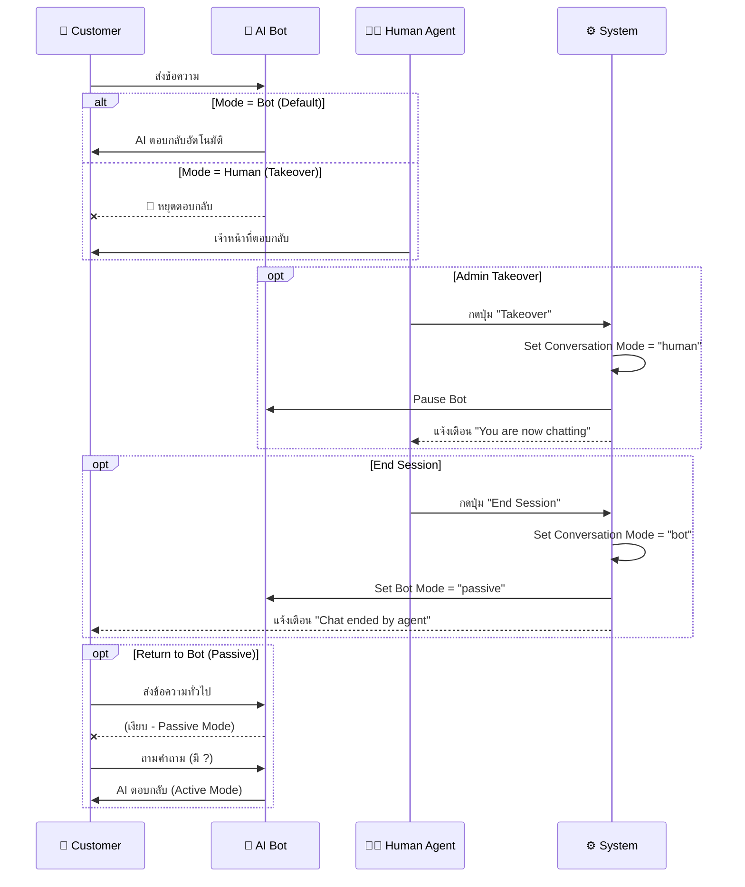

# 🚀 MiniChat - Enhanced Chatbot Architecture Plan
## End-to-End Sales & Automation System

> **วันที่จัดทำ:** 28 มกราคม 2026
> **วัตถุประสงค์:** ยกระดับระบบแชทบอทให้เป็น End-to-End Sales Platform พร้อม Automation ครบวงจร

---

## 📊 สรุปสถานะปัจจุบัน (Current State Analysis)

### ✅ ส่วนที่มีอยู่แล้ว
1. **AI Integration** - รองรับ 4 providers (Ollama, OpenRouter, Groq, Anthropic)
2. **Widget System** - Shadow DOM widget สำหรับ embed
3. **Session Management** - ระบบ session และ chat history
4. **User Authentication** - Login/Register + OAuth (Google, GitHub)
5. **Workspace Management** - ระบบจัดการ workspace และ API key
6. **Basic Settings** - ตั้งค่าสี, ตำแหน่ง, logo, welcome message

### ❌ ส่วนที่ขาดหายไปและต้องพัฒนา
1. **Product Catalog** - ไม่มีระบบจัดการสินค้า
2. **Sales Automation** - ไม่มีระบบปิดการขาย/สั่งซื้ออัตโนมัติ
3. **Smart Recommendations** - ไม่มีระบบแนะนำสินค้า
4. **Order Management** - ไม่มีระบบจัดการออเดอร์
5. **Notification System** - ไม่มีระบบแจ้งเตือนที่ครอบคลุม
6. **Conversation Flow Builder** - ไม่มีระบบออกแบบบทสนทนา
7. **Analytics Dashboard** - ข้อมูลวิเคราะห์ยังไม่ครบถ้วน
8. **Multi-Channel Support** - ยังไม่รองรับ Facebook, LINE, Instagram
9. **Payment Integration** - ยังไม่มีระบบชำระเงิน

---

## 🚀 ระบบ Live Chat Takeover (Real-time Human-Bot Handoff)

> **สถานะ:** 🚧 กำลังพัฒนา (Current Priority)
> **เป้าหมาย:** ให้เจ้าหน้าที่สามารถแทรกบทสนทนาได้ทันที โดยบอทจะหยุดทำงานอัตโนมัติ

### 🔄 System Flow Diagram



### 🛠️ Technical Implementation

#### 1. Database Schema (Conversation Model)
```javascript
const conversationSchema = {
    workspace: ObjectId,
    sessionId: String,
    mode: {
        type: String,
        enum: ['bot', 'human'],
        default: 'bot'
    },
    botMode: {
        type: String,
        enum: ['active', 'passive', 'off'],
        default: 'active'
    },
    takenOverBy: ObjectId, // User ID of agent
    takenOverAt: Date,
    messages: [ObjectId]
};
```

#### 2. Logic Flow
1.  **Takeover:** Agent กดปุ่ม $\rightarrow$ API `/check_takeover` $\rightarrow$ Update DB `mode='human'`
2.  **Messaging:**
    *   ถ้า `mode === 'human'`: บอทไม่ตอบเลยทุกกรณี
    *   ถ้า `mode === 'bot'`:
        *   `botMode === 'active'`: บอทตอบทุกข้อความ
        *   `botMode === 'passive'`: บอทตอบเฉพาะคำถาม (มี `?` หรือ keywords)
3.  **Handback:** Agent กด End Session $\rightarrow$ `mode='bot'`, `botMode='passive'`

---

## 🎯 เป้าหมายการพัฒนา (Development Goals)

### Phase 1: Foundation Enhancement (สัปดาห์ที่ 1-2)
**จุดประสงค์:** วางโครงสร้างพื้นฐานที่แข็งแรง

#### 1.1 Database Schema Enhancement
```javascript
// New Models to Create

// 1. Product Model
const productSchema = {
    workspace: ObjectId,          // เชื่อมกับ workspace
    name: String,                 // ชื่อสินค้า
    description: String,          // รายละเอียด
    price: Number,                // ราคา
    compareAtPrice: Number,       // ราคาเปรียบเทียบ (ขีดฆ่า)
    currency: String,             // สกุลเงิน (THB, USD)
    images: [String],             // รูปภาพสินค้า
    category: String,             // หมวดหมู่
    tags: [String],               // แท็กสำหรับค้นหา
    stock: {
        available: Number,        // สต็อกที่มี
        lowStockAlert: Number,    // แจ้งเตือนสต็อกต่ำ
        trackInventory: Boolean   // ติดตามสต็อกหรือไม่
    },
    variants: [{                  // ตัวเลือกสินค้า (เช่น สี, ไซส์)
        name: String,
        options: [String],
        price: Number,
        stock: Number
    }],
    isActive: Boolean,            // แสดงสินค้าหรือไม่
    metadata: {
        sku: String,              // รหัสสินค้า
        barcode: String,
        weight: Number,
        dimensions: Object
    },
    seo: {
        title: String,
        description: String,
        keywords: [String]
    },
    createdAt: Date,
    updatedAt: Date
};

// 2. Order Model
const orderSchema = {
    workspace: ObjectId,
    customer: {
        name: String,
        email: String,
        phone: String,
        sessionId: String,        // เชื่อม session จากแชท
        metadata: Object          // ข้อมูลเพิ่มเติม
    },
    items: [{
        product: ObjectId,
        productName: String,      // เก็บชื่อไว้กรณีสินค้าถูกลบ
        variant: String,
        quantity: Number,
        price: Number,
        subtotal: Number
    }],
    pricing: {
        subtotal: Number,
        discount: Number,
        discountCode: String,
        shipping: Number,
        tax: Number,
        total: Number,
        currency: String
    },
    status: {
        type: String,
        enum: [
            'pending',            // รอดำเนินการ
            'confirmed',          // ยืนยันแล้ว
            'processing',         // กำลังดำเนินการ
            'shipped',            // จัดส่งแล้ว
            'delivered',          // ส่งถึงแล้ว
            'cancelled',          // ยกเลิก
            'refunded'            // คืนเงิน
        ],
        default: 'pending'
    },
    payment: {
        method: String,           // 'bank_transfer', 'credit_card', 'qr_code'
        status: String,           // 'pending', 'paid', 'failed'
        paidAt: Date,
        transactionId: String,
        slipImage: String         // รูปหลักฐานการโอน
    },
    shipping: {
        address: {
            street: String,
            city: String,
            state: String,
            zipCode: String,
            country: String
        },
        method: String,           // 'standard', 'express', 'pickup'
        trackingNumber: String,
        carrier: String,          // 'Kerry', 'ThaiPost', 'Flash'
        shippedAt: Date,
        estimatedDelivery: Date
    },
    conversation: {
        messages: [ObjectId],     // อ้างอิง Message collection
        sessionId: String
    },
    notes: [{
        text: String,
        createdBy: String,        // 'customer' or 'admin'
        createdAt: Date
    }],
    timeline: [{                  // ประวัติการเปลี่ยนแปลง
        status: String,
        note: String,
        createdAt: Date
    }],
    createdAt: Date,
    updatedAt: Date
};

// 3. Conversation Flow Model
const flowSchema = {
    workspace: ObjectId,
    name: String,                 // ชื่อ flow (เช่น "Welcome Flow", "Product Inquiry")
    trigger: {
        type: String,             // 'keyword', 'intent', 'button_click'
        value: String,            // keyword หรือ intent
        conditions: Object        // เงื่อนไขเพิ่มเติม
    },
    nodes: [{                     // โหนดในการสนทนา
        id: String,
        type: String,             // 'message', 'question', 'action', 'condition'
        content: {
            text: String,
            buttons: [{
                label: String,
                action: String,   // 'next_node', 'show_products', 'create_order'
                value: String
            }],
            quickReplies: [String],
            cards: [{             // แสดงการ์ดสินค้า
                title: String,
                subtitle: String,
                image: String,
                buttons: Array
            }]
        },
        nextNode: String,         // ID ของโหนดถัดไป
        conditions: [{            // เงื่อนไขการกระโดดไปโหนดอื่น
            operator: String,     // 'equals', 'contains', 'greater_than'
            value: String,
            nextNode: String
        }],
        actions: [{               // การกระทำเมื่อถึงโหนดนี้
            type: String,         // 'save_data', 'send_email', 'create_lead'
            params: Object
        }]
    }],
    fallbackMessage: String,      // ข้อความเมื่อไม่เข้าใจ
    isActive: Boolean,
    priority: Number,             // ลำดับความสำคัญ (ใช้เมื่อมีหลาย flow ตรงกัน)
    createdAt: Date,
    updatedAt: Date
};

// 4. Lead/Customer Model
const leadSchema = {
    workspace: ObjectId,
    sessionId: String,            // เชื่อมกับ session
    name: String,
    email: String,
    phone: String,
    tags: [String],               // แท็กลูกค้า (เช่น 'hot_lead', 'vip')
    source: String,               // 'widget', 'facebook', 'line'
    interests: [String],          // สินค้าที่สนใจ
    conversations: [{
        date: Date,
        summary: String,
        sentiment: String         // 'positive', 'neutral', 'negative'
    }],
    orders: [ObjectId],           // ออเดอร์ทั้งหมด
    totalSpent: Number,
    lastContactedAt: Date,
    status: {
        type: String,
        enum: ['new', 'contacted', 'qualified', 'converted', 'lost'],
        default: 'new'
    },
    metadata: Object,             // ข้อมูลเพิ่มเติม
    createdAt: Date,
    updatedAt: Date
};

// 5. Notification Model
const notificationSchema = {
    workspace: ObjectId,
    type: String,                 // 'new_order', 'low_stock', 'new_lead'
    title: String,
    message: String,
    priority: String,             // 'low', 'medium', 'high', 'urgent'
    isRead: Boolean,
    relatedTo: {
        model: String,            // 'Order', 'Product', 'Lead'
        id: ObjectId
    },
    recipients: [{
        type: String,             // 'admin', 'email', 'webhook'
        value: String
    }],
    createdAt: Date
};

// 6. Analytics Event Model
const analyticsSchema = {
    workspace: ObjectId,
    sessionId: String,
    event: String,                // 'message_sent', 'product_viewed', 'order_created'
    data: Object,                 // ข้อมูลเหตุการณ์
    metadata: {
        userAgent: String,
        ip: String,
        referrer: String,
        pageUrl: String
    },
    timestamp: Date
};

// 7. Template Message Model
const templateSchema = {
    workspace: ObjectId,
    name: String,                 // ชื่อ template
    category: String,             // 'greeting', 'product_info', 'order_confirmation'
    content: {
        text: String,             // รองรับ variables เช่น {{customer_name}}
        buttons: Array,
        quickReplies: Array,
        cards: Array
    },
    variables: [String],          // ตัวแปรที่ใช้ในข้อความ
    isActive: Boolean,
    usageCount: Number,
    createdAt: Date,
    updatedAt: Date
};
```

#### 1.2 API Enhancement Strategy
```javascript
// New API Endpoints Structure

/* ==================== Product Management APIs ==================== */
// POST   /api/products                  - สร้างสินค้า
// GET    /api/products                  - ดึงรายการสินค้า (pagination, filter)
// GET    /api/products/:id              - ดึงข้อมูลสินค้า 1 รายการ
// PUT    /api/products/:id              - แก้ไขสินค้า
// DELETE /api/products/:id              - ลบสินค้า
// POST   /api/products/bulk-upload      - อัพโหลดสินค้าแบบจำนวนมาก (CSV/Excel)
// GET    /api/products/search           - ค้นหาสินค้า (fulltext search)
// GET    /api/products/categories       - ดึงหมวดหมู่สินค้า

/* ==================== Order Management APIs ==================== */
// POST   /api/orders                    - สร้างออเดอร์
// GET    /api/orders                    - ดึงรายการออเดอร์
// GET    /api/orders/:id                - ดึงข้อมูลออเดอร์
// PUT    /api/orders/:id/status         - อัพเดทสถานะ
// POST   /api/orders/:id/payment        - อัพเดทข้อมูลการชำระเงิน
// POST   /api/orders/:id/shipping       - อัพเดทข้อมูลการจัดส่ง
// POST   /api/orders/:id/cancel         - ยกเลิกออเดอร์
// GET    /api/orders/:id/timeline       - ดึงประวัติการเปลี่ยนแปลง

/* ==================== Conversation Flow APIs ==================== */
// POST   /api/flows                     - สร้าง flow
// GET    /api/flows                     - ดึงรายการ flows
// GET    /api/flows/:id                 - ดึงข้อมูล flow
// PUT    /api/flows/:id                 - แก้ไข flow
// DELETE /api/flows/:id                 - ลบ flow
// POST   /api/flows/:id/test            - ทดสอบ flow

/* ==================== Lead Management APIs ==================== */
// POST   /api/leads                     - สร้าง lead
// GET    /api/leads                     - ดึงรายการ leads
// GET    /api/leads/:id                 - ดึงข้อมูล lead
// PUT    /api/leads/:id                 - อัพเดท lead
// POST   /api/leads/:id/tag             - เพิ่ม tag
// GET    /api/leads/export              - Export leads (CSV)

/* ==================== Notification APIs ==================== */
// GET    /api/notifications             - ดึงการแจ้งเตือน
// PUT    /api/notifications/:id/read    - ทำเครื่องหมายว่าอ่านแล้ว
// POST   /api/notifications/settings    - ตั้งค่าการแจ้งเตือน
// DELETE /api/notifications/:id         - ลบการแจ้งเตือน

/* ==================== Analytics APIs ==================== */
// GET    /api/analytics/overview        - ภาพรวมสถิติ
// GET    /api/analytics/sales           - สถิติการขาย
// GET    /api/analytics/conversations   - สถิติการสนทนา
// GET    /api/analytics/products        - สินค้ายอดนิยม
// GET    /api/analytics/customers       - พฤติกรรมลูกค้า
// POST   /api/analytics/events          - บันทึกเหตุการณ์

/* ==================== Template APIs ==================== */
// POST   /api/templates                 - สร้าง template
// GET    /api/templates                 - ดึงรายการ templates
// GET    /api/templates/:id             - ดึงข้อมูล template
// PUT    /api/templates/:id             - แก้ไข template
// DELETE /api/templates/:id             - ลบ template

/* ==================== Widget Enhancement APIs ==================== */
// POST   /api/widget/recommend          - แนะนำสินค้า (AI-powered)
// POST   /api/widget/cart/add           - เพิ่มสินค้าในตะกร้า
// GET    /api/widget/cart               - ดึงข้อมูลตะกร้า
// POST   /api/widget/checkout           - ดำเนินการชำระเงิน
// POST   /api/widget/feedback           - รับ feedback
```

---

### Phase 2: Smart Conversation System (สัปดาห์ที่ 3-4)
**จุดประสงค์:** สร้างระบบสนทนาอัจฉริยะที่นำไปสู่การขาย

#### 2.1 Intent Detection & Entity Extraction
```javascript
// Intent Classification System

const intentClassifier = {
    // ตัวอย่าง intents
    intents: [
        'product_inquiry',        // ถามเรื่องสินค้า
        'price_check',            // ถามราคา
        'order_status',           // ตรวจสอบสถานะ
        'make_purchase',          // ต้องการซื้อ
        'complaint',              // ร้องเรียน
        'general_question',       // คำถามทั่วไป
        'greeting',               // ทักทาย
        'goodbye'                 // ลา
    ],

    // Entity Extraction (ดึงข้อมูลสำคัญ)
    entities: {
        product_name: String,     // ชื่อสินค้า
        quantity: Number,         // จำนวน
        price_range: Object,      // ช่วงราคา
        color: String,            // สี
        size: String,             // ไซส์
        date: Date,               // วันที่
        phone: String,            // เบอร์โทร
        email: String             // อีเมล
    }
};

// ตัวอย่างการใช้งาน
async function processMessage(message) {
    // 1. Detect Intent
    const intent = await detectIntent(message);

    // 2. Extract Entities
    const entities = await extractEntities(message);

    // 3. Route to appropriate handler
    switch(intent) {
        case 'product_inquiry':
            return await handleProductInquiry(entities);
        case 'make_purchase':
            return await handlePurchase(entities);
        case 'order_status':
            return await handleOrderStatus(entities);
        // ... อื่นๆ
    }
}
```

#### 2.2 Context Management
```javascript
// Conversation Context System

const contextManager = {
    // เก็บ context ของแต่ละ session
    sessions: new Map(),

    // บันทึก context
    saveContext(sessionId, context) {
        this.sessions.set(sessionId, {
            ...context,
            lastUpdated: Date.now(),
            ttl: 30 * 60 * 1000  // 30 นาที
        });
    },

    // ดึง context
    getContext(sessionId) {
        const ctx = this.sessions.get(sessionId);
        if (!ctx) return null;

        // ตรวจสอบว่าหมดอายุหรือยัง
        if (Date.now() - ctx.lastUpdated > ctx.ttl) {
            this.sessions.delete(sessionId);
            return null;
        }

        return ctx;
    }
};

// ตัวอย่าง Context Structure
const conversationContext = {
    sessionId: 'sess_123',
    currentIntent: 'product_inquiry',
    entities: {
        interested_products: ['product_id_1', 'product_id_2'],
        price_range: { min: 100, max: 500 },
        preferred_color: 'red'
    },
    cart: {
        items: [],
        total: 0
    },
    customer: {
        name: null,
        phone: null,
        email: null
    },
    stage: 'browsing',  // 'browsing', 'considering', 'ready_to_buy', 'purchased'
    lastMessage: Date.now(),
    messageCount: 5
};
```

#### 2.3 Recommendation Engine
```javascript
// AI-Powered Product Recommendation System

class RecommendationEngine {
    constructor(workspace) {
        this.workspace = workspace;
    }

    // แนะนำสินค้าจาก AI
    async recommendProducts(context) {
        const { entities, conversation } = context;

        // 1. ดึงสินค้าที่เกี่ยวข้อง
        let products = await this.findRelevantProducts(entities);

        // 2. Score สินค้า
        products = products.map(p => ({
            ...p,
            score: this.calculateRelevanceScore(p, context)
        }));

        // 3. Sort ตาม score
        products.sort((a, b) => b.score - a.score);

        // 4. สร้างข้อความแนะนำด้วย AI
        const recommendation = await this.generateRecommendationMessage(
            products.slice(0, 3),  // แนะนำ 3 อันดับแรก
            context
        );

        return {
            products: products.slice(0, 3),
            message: recommendation
        };
    }

    // คำนวณคะแนนความเกี่ยวข้อง
    calculateRelevanceScore(product, context) {
        let score = 0;

        // ราคาตรงกับที่ต้องการ
        if (context.entities.price_range) {
            const { min, max } = context.entities.price_range;
            if (product.price >= min && product.price <= max) {
                score += 30;
            }
        }

        // สีตรงกับที่ต้องการ
        if (context.entities.preferred_color) {
            if (product.variants?.some(v =>
                v.options.includes(context.entities.preferred_color)
            )) {
                score += 20;
            }
        }

        // สินค้าขายดี
        score += (product.salesCount || 0) * 0.1;

        // มีสต็อก
        if (product.stock?.available > 0) {
            score += 10;
        }

        // Rating สูง
        score += (product.rating || 0) * 5;

        return score;
    }

    // สร้างข้อความแนะนำด้วย AI
    async generateRecommendationMessage(products, context) {
        const prompt = `
Based on customer's interest in ${context.entities.product_name || 'products'},
recommend these products in Thai language (friendly and sales-oriented):

${products.map((p, i) => `
${i+1}. ${p.name} - ${p.price} บาท
   ${p.description}
`).join('\n')}

Make it conversational and persuasive.
        `;

        // ส่งไปที่ AI provider
        const response = await callAI(prompt, context.workspace);
        return response.content;
    }
}
```

---

### Phase 3: Sales Automation (สัปดาห์ที่ 5-6)
**จุดประสงค์:** ระบบขายอัตโนมัติ ตั้งแต่เลือกสินค้าจนชำระเงิน

#### 3.1 Shopping Cart in Chat
```javascript
// In-Chat Shopping Cart System

class ChatCartManager {
    // เพิ่มสินค้าในตะกร้า
    async addToCart(sessionId, productId, quantity = 1, variant = null) {
        const context = await getContext(sessionId);
        const product = await Product.findById(productId);

        if (!product) {
            throw new Error('Product not found');
        }

        // ตรวจสอบสต็อก
        if (product.stock.trackInventory) {
            const availableStock = variant
                ? product.variants.find(v => v.name === variant)?.stock
                : product.stock.available;

            if (availableStock < quantity) {
                throw new Error('Insufficient stock');
            }
        }

        // เพิ่มในตะกร้า
        const cartItem = {
            product: product._id,
            productName: product.name,
            variant: variant,
            quantity: quantity,
            price: variant
                ? product.variants.find(v => v.name === variant)?.price
                : product.price,
            subtotal: 0
        };

        cartItem.subtotal = cartItem.price * cartItem.quantity;

        if (!context.cart) context.cart = { items: [], total: 0 };

        // ตรวจสอบว่ามีสินค้านี้ในตะกร้าแล้วหรือไม่
        const existingItem = context.cart.items.find(
            item => item.product === productId && item.variant === variant
        );

        if (existingItem) {
            existingItem.quantity += quantity;
            existingItem.subtotal = existingItem.price * existingItem.quantity;
        } else {
            context.cart.items.push(cartItem);
        }

        // คำนวณยอดรวม
        context.cart.total = context.cart.items.reduce(
            (sum, item) => sum + item.subtotal, 0
        );

        await saveContext(sessionId, context);

        return {
            message: `เพิ่ม ${product.name} ${quantity} ชิ้น ลงในตะกร้าแล้วค่ะ\n\nตะกร้าของคุณตอนนี้มี ${context.cart.items.length} รายการ รวม ${context.cart.total.toLocaleString()} บาท`,
            cart: context.cart
        };
    }

    // แสดงตะกร้า
    async viewCart(sessionId) {
        const context = await getContext(sessionId);

        if (!context.cart || context.cart.items.length === 0) {
            return {
                message: 'ตะกร้าของคุณว่างเปล่าค่ะ',
                cart: null
            };
        }

        let message = '🛒 ตะกร้าของคุณ:\n\n';

        context.cart.items.forEach((item, index) => {
            message += `${index + 1}. ${item.productName}`;
            if (item.variant) message += ` (${item.variant})`;
            message += `\n   จำนวน: ${item.quantity} ชิ้น\n`;
            message += `   ราคา: ${item.subtotal.toLocaleString()} บาท\n\n`;
        });

        message += `💰 รวมทั้งหมด: ${context.cart.total.toLocaleString()} บาท`;

        return {
            message: message,
            cart: context.cart,
            buttons: [
                { label: '🗑️ ล้างตะกร้า', action: 'clear_cart' },
                { label: '💳 ชำระเงิน', action: 'checkout' }
            ]
        };
    }

    // ชำระเงิน
    async checkout(sessionId, customerInfo) {
        const context = await getContext(sessionId);

        if (!context.cart || context.cart.items.length === 0) {
            throw new Error('Cart is empty');
        }

        // สร้างออเดอร์
        const order = await Order.create({
            workspace: context.workspaceId,
            customer: {
                name: customerInfo.name,
                email: customerInfo.email,
                phone: customerInfo.phone,
                sessionId: sessionId
            },
            items: context.cart.items,
            pricing: {
                subtotal: context.cart.total,
                discount: 0,
                shipping: 0,  // คำนวณค่าจัดส่ง
                tax: 0,
                total: context.cart.total,
                currency: 'THB'
            },
            status: 'pending',
            payment: {
                status: 'pending'
            },
            conversation: {
                sessionId: sessionId
            }
        });

        // ล้างตะกร้า
        context.cart = { items: [], total: 0 };
        await saveContext(sessionId, context);

        // ส่งการแจ้งเตือน
        await this.sendOrderNotification(order);

        return {
            order: order,
            message: `✅ สร้างออเดอร์สำเร็จ!\n\nเลขที่ออเดอร์: ${order._id}\n\nกรุณาโอนเงิน ${order.pricing.total.toLocaleString()} บาท\nและอัพโหลดสลิปโอนเงินค่ะ`
        };
    }

    // ส่งการแจ้งเตือนออเดอร์ใหม่
    async sendOrderNotification(order) {
        await Notification.create({
            workspace: order.workspace,
            type: 'new_order',
            title: 'มีออเดอร์ใหม่',
            message: `ออเดอร์ #${order._id} จากคุณ ${order.customer.name}`,
            priority: 'high',
            relatedTo: {
                model: 'Order',
                id: order._id
            }
        });

        // ส่งอีเมลแจ้งเตือน (ถ้าตั้งค่าไว้)
        // ส่ง webhook (ถ้าตั้งค่าไว้)
    }
}
```

#### 3.2 Automated Sales Flow
```javascript
// ตัวอย่าง Sales Flow Automation

const salesFlows = {
    // Flow 1: Product Discovery → Recommendation → Purchase
    productDiscovery: {
        trigger: { type: 'intent', value: 'product_inquiry' },
        steps: [
            {
                type: 'question',
                content: 'คุณกำลังมองหาสินค้าประเภทไหนคะ?',
                quickReplies: ['เสื้อผ้า', 'รองเท้า', 'กระเป๋า', 'อื่นๆ']
            },
            {
                type: 'action',
                action: 'recommend_products',
                onSuccess: {
                    type: 'message',
                    content: 'เราขอแนะนำสินค้าเหล่านี้ค่ะ:',
                    showProducts: true
                }
            },
            {
                type: 'question',
                content: 'สนใจสินค้าไหนคะ?',
                buttons: [
                    { label: 'ดูรายละเอียด', action: 'show_details' },
                    { label: 'เพิ่มในตะกร้า', action: 'add_to_cart' }
                ]
            },
            {
                type: 'condition',
                check: 'cart_not_empty',
                ifTrue: {
                    type: 'question',
                    content: 'ต้องการสั่งซื้อเลยไหมคะ?',
                    buttons: [
                        { label: '✅ สั่งซื้อเลย', action: 'checkout' },
                        { label: '🛍️ ช้อปต่อ', action: 'continue_shopping' }
                    ]
                }
            }
        ]
    },

    // Flow 2: Abandoned Cart Recovery
    abandonedCart: {
        trigger: {
            type: 'condition',
            check: 'cart_not_empty_and_inactive_5min'
        },
        steps: [
            {
                type: 'message',
                content: '👋 ยังคิดถึงสินค้าในตะกร้าอยู่ไหมคะ?\n\nเรามีโปรโมชั่นพิเศษสำหรับคุณค่ะ ลด 10% เมื่อสั่งซื้อภายใน 30 นาที! 🎉'
            },
            {
                type: 'action',
                action: 'apply_discount',
                params: { code: 'COMEBACK10', percentage: 10 }
            }
        ]
    },

    // Flow 3: Post-Purchase Follow-up
    postPurchase: {
        trigger: {
            type: 'event',
            value: 'order_delivered'
        },
        steps: [
            {
                type: 'message',
                content: '✨ สินค้าถึงมือคุณแล้วใช่ไหมคะ?\n\nรบกวนรีวิวให้เราหน่อยนะคะ 🙏'
            },
            {
                type: 'question',
                content: 'พอใจกับสินค้าไหมคะ?',
                quickReplies: ['⭐⭐⭐⭐⭐ มากเลย', '⭐⭐⭐⭐ พอใจ', '⭐⭐⭐ ปานกลาง', '⭐⭐ ไม่ค่อยพอใจ']
            }
        ]
    }
};
```

---

### Phase 4: Enhanced User Experience (สัปดาห์ที่ 7-8)
**จุดประสงค์:** ปรับปรุง UI/UX ให้ใช้งานง่ายและสวยงาม

#### 4.1 Widget Enhancements
```javascript
// Enhanced Widget Features

const widgetFeatures = {
    // 1. Product Cards in Chat
    productCard: {
        template: `
            <div class="product-card">
                
                <h3>{{name}}</h3>
                <p class="description">{{description}}</p>
                <div class="price">
                    <span class="current">{{price}} บาท</span>
                    {{#if compareAtPrice}}
                    <span class="original">{{compareAtPrice}} บาท</span>
                    {{/if}}
                </div>
                <div class="actions">
                    <button onclick="viewDetails('{{id}}')">ดูรายละเอียด</button>
                    <button onclick="addToCart('{{id}}')">เพิ่มในตะกร้า</button>
                </div>
            </div>
        `
    },

    // 2. Cart Preview
    cartPreview: {
        showBadge: true,  // แสดงจำนวนสินค้า
        quickView: true,  // ดูตะกร้าได้ไม่ต้องเปิดแชท
        miniCart: true    // แสดงตะกร้าย่อ
    },

    // 3. Rich Messages
    richMessages: {
        carousel: true,        // แสดงสินค้าแบบเลื่อน
        buttons: true,         // ปุ่มกดในแชท
        quickReplies: true,    // คำตอบเร็ว
        forms: true,           // ฟอร์มในแชท
        images: true,          // แสดงรูปภาพ
        videos: true           // แสดงวิดีโอ
    },

    // 4. Typing Indicators
    typingIndicator: {
        showWhenAIThinking: true,
        customAnimation: true
    },

    // 5. Read Receipts
    readReceipts: {
        showSent: true,
        showDelivered: true,
        showRead: true
    },

    // 6. Sound Notifications
    sounds: {
        newMessage: true,
        orderConfirmed: true,
        customSounds: {}
    }
};
```

#### 4.2 Dashboard Enhancements
```javascript
// Enhanced Dashboard Features

const dashboardSections = {
    // 1. Overview Dashboard
    overview: {
        metrics: [
            { label: 'ยอดขายวันนี้', value: 'daily_sales', format: 'currency' },
            { label: 'ออเดอร์ใหม่', value: 'new_orders', format: 'number' },
            { label: 'ลูกค้าใหม่', value: 'new_leads', format: 'number' },
            { label: 'Conversion Rate', value: 'conversion_rate', format: 'percentage' }
        ],
        charts: [
            { type: 'line', title: 'ยอดขายรายวัน', data: 'daily_sales_chart' },
            { type: 'bar', title: 'สินค้าขายดี', data: 'top_products' },
            { type: 'pie', title: 'สัดส่วนช่องทาง', data: 'channel_distribution' }
        ]
    },

    // 2. Product Management
    products: {
        features: [
            'bulk_upload',           // อัพโหลดจำนวนมาก
            'category_management',   // จัดการหมวดหมู่
            'variant_management',    // จัดการตัวเลือก
            'stock_alerts',          // แจ้งเตือนสต็อก
            'price_rules',           // กฎราคา
            'seo_optimization'       // ปรับแต่ง SEO
        ],
        views: [
            'grid',    // แสดงแบบตาราง
            'list',    // แสดงแบบรายการ
            'compact'  // แสดงแบบย่อ
        ]
    },

    // 3. Order Management
    orders: {
        filters: [
            'status',     // กรองตามสถานะ
            'date_range', // ช่วงเวลา
            'customer',   // ลูกค้า
            'payment',    // การชำระเงิน
            'total'       // ยอดเงิน
        ],
        actions: [
            'bulk_status_update',    // อัพเดทสถานะหลายออเดอร์
            'print_invoice',         // พิมพ์ใบแจ้งหนี้
            'export_orders',         // Export ออเดอร์
            'send_tracking'          // ส่งเลขพัสดุ
        ],
        automation: [
            'auto_confirm',          // ยืนยันอัตโนมัติ
            'auto_shipping_label',   // สร้างฉลากจัดส่งอัตโนมัติ
            'auto_tracking_update'   // อัพเดทเลขพัสดุอัตโนมัติ
        ]
    },

    // 4. Conversation Management
    conversations: {
        features: [
            'live_chat_takeover',    // ผู้ดูแลเข้ามาตอบ
            'canned_responses',      // ข้อความสำเร็จรูป
            'conversation_tags',     // แท็กสนทนา
            'sentiment_analysis',    // วิเคราะห์อารมณ์
            'conversation_notes'     // บันทึกสนทนา
        ],
        filters: [
            'active',         // กำลังสนทนา
            'pending',        // รอตอบ
            'resolved',       // จบการสนทนา
            'escalated'       // ส่งต่อ
        ]
    },

    // 5. Analytics Dashboard
    analytics: {
        reports: [
            'sales_report',          // รายงานการขาย
            'product_performance',   // ประสิทธิภาพสินค้า
            'customer_behavior',     // พฤติกรรมลูกค้า
            'conversation_metrics',  // สถิติการสนทนา
            'ai_performance'         // ประสิทธิภาพ AI
        ],
        export: [
            'pdf',
            'excel',
            'csv'
        ]
    },

    // 6. Settings
    settings: {
        sections: [
            'workspace',        // ตั้งค่า workspace
            'ai_provider',      // ตั้งค่า AI
            'appearance',       // หน้าตา widget
            'automation',       // การทำงานอัตโนมัติ
            'notifications',    // การแจ้งเตือน
            'integrations',     // การเชื่อมต่อ
            'team',             // ทีม
            'billing'           // การเรียกเก็บเงิน
        ]
    }
};
```

---

### Phase 5: Advanced Features (สัปดาห์ที่ 9-10)
**จุดประสงค์:** ฟีเจอร์ขั้นสูงที่แตกต่างจากคู่แข่ง

#### 5.1 Multi-Channel Integration
```javascript
// Multi-Channel Support

const channels = {
    facebook: {
        setup: 'Facebook Messenger Integration',
        features: [
            'auto_reply_comments',
            'inbox_management',
            'page_messaging'
        ]
    },
    line: {
        setup: 'LINE Official Account Integration',
        features: [
            'rich_menus',
            'flex_messages',
            'broadcast'
        ]
    },
    instagram: {
        setup: 'Instagram Direct Message Integration',
        features: [
            'story_replies',
            'comment_replies',
            'dm_management'
        ]
    },
    whatsapp: {
        setup: 'WhatsApp Business API',
        features: [
            'template_messages',
            'quick_replies',
            'media_sharing'
        ]
    }
};
```

#### 5.2 AI Training & Customization
```javascript
// Custom AI Training

const aiTraining = {
    // 1. Fine-tuning Data
    trainingData: {
        conversations: [],       // การสนทนาจริง
        products: [],           // ข้อมูลสินค้า
        faqs: [],              // คำถามที่พบบ่อย
        brandVoice: String     // น้ำเสียงแบรนด์
    },

    // 2. Knowledge Base
    knowledgeBase: {
        articles: [],          // บทความ
        documents: [],         // เอกสาร
        policies: [],          // นโยบาย
        customRules: []        // กฎการตอบที่กำหนดเอง
    },

    // 3. Response Patterns
    patterns: {
        greeting: String,
        farewell: String,
        confusion: String,
        outOfScope: String
    }
};
```

#### 5.3 Payment Integration
```javascript
// Payment Gateway Integration

const paymentMethods = {
    bank_transfer: {
        enabled: true,
        banks: ['SCB', 'KBANK', 'BBL', 'KTB'],
        autoVerification: false  // ตรวจสอบการชำระเงินอัตโนมัติ (Premium)
    },
    qr_code: {
        enabled: true,
        provider: 'PromptPay',
        autoGenerate: true
    },
    credit_card: {
        enabled: false,
        provider: 'Omise',  // หรือ GB Prime Pay
        apiKey: process.env.PAYMENT_API_KEY
    },
    mobile_banking: {
        enabled: false,
        providers: ['TrueMoney', 'Rabbit LINE Pay']
    }
};
```

---

## 🏗️ Technical Implementation Details

### Backend Stack
```javascript
// Required Dependencies
const dependencies = {
    // Core
    'express': '^4.18.0',
    'mongoose': '^7.0.0',

    // AI & ML
    'axios': '^1.3.0',              // API calls
    '@tensorflow/tfjs-node': '^4.0.0',  // Intent classification
    'natural': '^5.0.0',            // NLP
    'compromise': '^14.0.0',        // Entity extraction

    // Real-time
    'socket.io': '^4.5.0',          // WebSocket

    // File Upload
    'multer': '^1.4.5',
    'sharp': '^0.31.0',             // Image processing

    // Payment
    'omise': '^0.11.0',             // Payment gateway

    // CSV/Excel
    'xlsx': '^0.18.0',
    'csv-parser': '^3.0.0',

    // Queue (สำหรับ automation)
    'bull': '^4.10.0',
    'ioredis': '^5.3.0',

    // Email
    'nodemailer': '^6.9.0',

    // Validation
    'joi': '^17.7.0',

    // Security
    'helmet': '^7.0.0',
    'express-rate-limit': '^6.7.0'
};
```

### Frontend Stack
```javascript
// Enhanced Frontend Dependencies
const frontendDeps = {
    // Core
    'next': '^14.0.0',
    'react': '^18.2.0',

    // UI Components
    'lucide-react': '^0.263.0',     // Icons
    '@headlessui/react': '^1.7.0',  // Accessible components

    // Charts
    'recharts': '^2.5.0',           // Data visualization

    // Forms
    'react-hook-form': '^7.43.0',
    'zod': '^3.21.0',               // Validation

    // Drag & Drop (for flow builder)
    'react-beautiful-dnd': '^13.1.1',

    // Rich Text
    'slate': '^0.94.0',             // Rich text editor

    // Date
    'date-fns': '^2.29.0',

    // State Management
    'zustand': '^4.3.0'
};
```

---

## 📈 Success Metrics

### Key Performance Indicators (KPIs)
```javascript
const successMetrics = {
    // Engagement
    totalConversations: Number,
    avgMessagesPerSession: Number,
    avgSessionDuration: Number,

    // Sales
    conversionRate: Number,        // ลูกค้าที่ซื้อ / ลูกค้าทั้งหมด
    avgOrderValue: Number,
    totalRevenue: Number,

    // AI Performance
    intentAccuracy: Number,        // ความแม่นยำการเข้าใจ intent
    responseTime: Number,          // เวลาตอบกลับ
    handoffRate: Number,           // อัตราที่ต้องส่งต่อคน

    // Customer Satisfaction
    csat: Number,                  // Customer Satisfaction Score
    nps: Number                    // Net Promoter Score
};
```

---

## 🚀 Implementation Roadmap

### ลำดับการพัฒนาที่แนะนำ

#### Sprint 1-2: Database & API Foundation
- [ ] สร้าง Product, Order, Lead, Flow models
- [ ] สร้าง REST APIs ทั้งหมด
- [ ] ทดสอบ APIs ด้วย Postman
- [ ] เขียน API documentation

#### Sprint 3-4: Smart Conversation System
- [ ] Intent detection system
- [ ] Entity extraction
- [ ] Context management
- [ ] Recommendation engine

#### Sprint 5-6: Sales Automation
- [ ] Shopping cart in chat
- [ ] Checkout flow
- [ ] Order management
- [ ] Payment integration

#### Sprint 7-8: UI/UX Enhancement
- [ ] Product management dashboard
- [ ] Order management dashboard
- [ ] Enhanced widget with product cards
- [ ] Analytics dashboard

#### Sprint 9-10: Advanced Features
- [ ] Multi-channel integration
- [ ] AI training interface
- [ ] Advanced automation
- [ ] Performance optimization

---

## 💡 Key Recommendations

### ความสำคัญสูงสุด (Must Have)
1. ✅ **Product Catalog System** - หัวใจของระบบขาย
2. ✅ **Shopping Cart in Chat** - ต้องใช้งานง่าย ไม่ต้องออกจากแชท
3. ✅ **Intent Detection** - AI ต้องเข้าใจความต้องการลูกค้า
4. ✅ **Order Management** - ระบบจัดการออเดอร์ที่ครบวงจร
5. ✅ **Notification System** - แจ้งเตือนทุกเหตุการณ์สำคัญ

### สำคัญ (Should Have)
1. 🔶 **Recommendation Engine** - แนะนำสินค้าอัจฉริยะ
2. 🔶 **Analytics Dashboard** - ข้อมูลเชิงลึกเพื่อตัดสินใจ
3. 🔶 **Flow Builder** - ออกแบบบทสนทนาเอง
4. 🔶 **Multi-Channel** - รองรับหลายช่องทาง

### เพิ่มเติม (Nice to Have)
1. 🔷 **AI Training** - ฝึกสอน AI เอง
2. 🔷 **A/B Testing** - ทดสอบกลยุทธ์ต่างๆ
3. 🔷 **Advanced Analytics** - วิเคราะห์เชิงลึก

---

## 📞 Next Steps

### ขั้นตอนถัดไป
1. **Review แผนนี้** - ตรวจสอบว่าครอบคลุมความต้องการหรือไม่
2. **กำหนด Priority** - เลือกว่าจะเริ่มจาก Phase ไหนก่อน
3. **Setup Development Environment** - เตรียมเครื่องมือพัฒนา
4. **เริ่ม Sprint 1** - เริ่มพัฒนา Database Schema

### คำถามที่ควรตอบก่อนเริ่ม
- ต้องการเริ่มจาก Phase ไหนก่อน?
- มีทีมพัฒนากี่คน? ทักษะอะไรบ้าง?
- Timeline ที่ต้องการคือเท่าไหร่?
- Budget สำหรับ Third-party services (Payment, SMS, Email) มีเท่าไหร่?
- ต้องการรองรับภาษาอื่นนอกจากไทย-อังกฤษไหม?

---

## 📚 Resources & References

### Documentation
- [Stripe Payment Integration](https://stripe.com/docs)
- [Omise Thailand](https://www.omise.co/docs)
- [Facebook Messenger API](https://developers.facebook.com/docs/messenger-platform)
- [LINE Messaging API](https://developers.line.biz/en/docs/messaging-api/)
- [Socket.io Documentation](https://socket.io/docs/)
- [TensorFlow.js](https://www.tensorflow.org/js)

### Inspiration
- Chatbot.com Widget API
- Zwiz.ai Features
- Intercom Product Tours
- Drift Conversation AI
- ManyChat Flow Builder

---

**สรุป:** แผนนี้ครอบคลุม End-to-End Sales Chatbot ตั้งแต่ระบบสินค้า, การสนทนาอัจฉริยะ, การขายอัตโนมัติ, ไปจนถึง Analytics ครบวงจร พร้อมทั้งมี UI/UX ที่ดี ใช้งานง่าย และ Scalable สำหรับธุรกิจทุกขนาด
